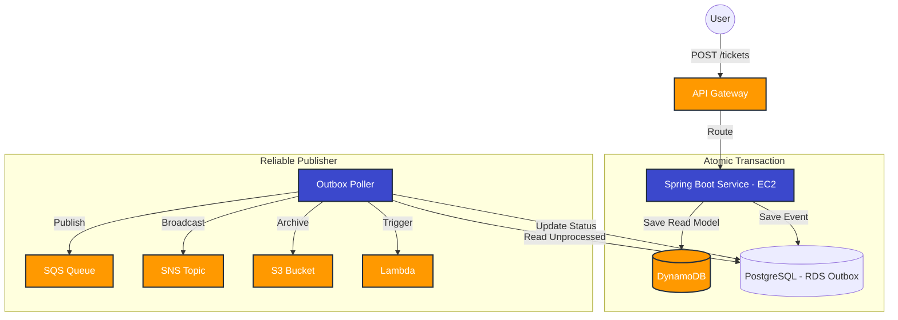

# AWS Event-Driven Cloud Orchestrator

This project is a high-performance orchestration engine built using **Spring Boot** and the **AWS Java SDK (v2)**. It implements an asynchronous, decoupled architecture using the "Core Nine" AWS services, providing a production-grade blueprint for cloud-native applications.

## 🏛 Architecture
The system uses an **Event-Driven Resilience** pattern with a **Transactional Outbox**:
1. **API Gateway** acts as the secured entry point.
2. **Lambda** performs initial serverless validation.
3. **Transactional Outbox**: Business logic (DynamoDB) and Events (Postgres) are saved in a single atomic transaction.
4. **Polling Publisher**: A background worker polls the outbox every 5 seconds and publishes confirmed events to AWS.
5. **SQS** buffers requests to handle traffic spikes.
6. **SNS** fan-out triggers multi-service actions.
7. **S3** archives transaction artifacts (e-receipts).
8. **CloudWatch** provides 360-degree observability.
9. **Secrets Manager** secures automated credential rotation.

### 📊 System Flow Diagram


## 💎 Resume Highlights
- **Distributed Async Processing**: Leveraged SQS as a durable buffer between microservices to prevent data loss.
- **Serverless Integration**: Integrated AWS Lambda for event-triggered validation and lightweight compute tasks.
- **High-Scale Storage**: Designed optimized NoSQL data models in DynamoDB for rapid state transitions.
- **DevSecOps**: Standardized credential security using AWS Secrets Manager and fine-grained IAM resource policies.

## 🛠 Local Setup
The entire stack is verified locally using **Localstack**.

1. **Start Infrastructure**:
   ```bash
   docker-compose up -d
   ```

2. **Run Application**:
   ```bash
   mvn spring-boot:run
   ```

---
**Designed by Shivam Srivastav**
